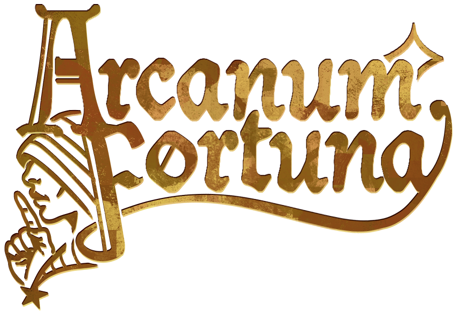
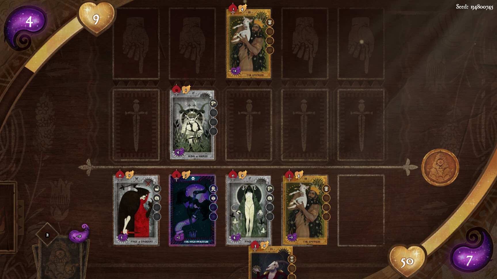
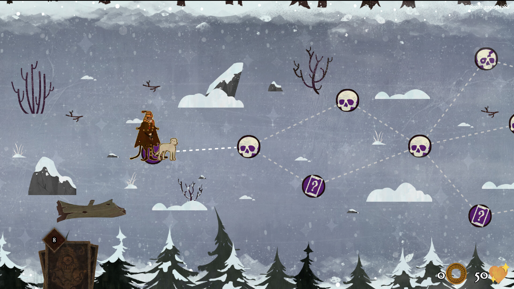
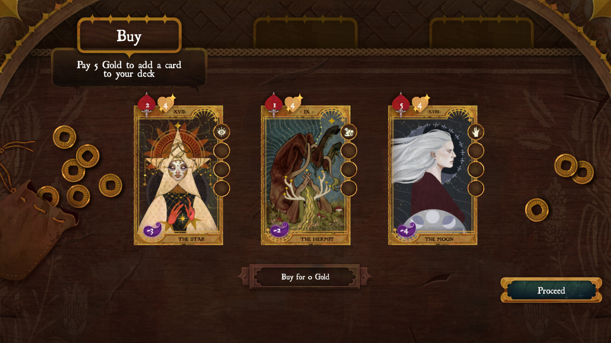

[Download on itch](https://s4g.itch.io/arcanum-fortuna) -
[Download on Steam](https://store.steampowered.com/app/2852690/Arcanum_Fortuna/) -
[Project Page](https://mondanzo.de/#arcanumfortuna)

**Notice: The version uploaded here is a pre-release prior to me leaving the team. Therefore the final product and this version have very different visual appearances and partially logic.**

# About

Arcanum Fortuna is an asymmetrical strategy roguelike deckbuilder inspired by classic tarot cards with a unique karma mechanic. Set out to explore a world of mystery with your four-legged companion and meet a colorful cast of characters. Will you find your purpose within?

## Key Informations:
Engine: Godot 4.2

Team Size: 7 people

Platform: PC

Genre: Endless Runner with Resource Management

Participation Duration: 6 weeks

Release: 14.02.2024

Number of Players: Single Player

# Role in the team

- Procedural Generation
- UI Programming
- VFX Programming
- Shader Programming

# Tasks in the project

- VCS Administration
- [Tutorial System](systems/tutorial)
- [Node Map](systems/dungeon_exploration/)
- [Event System](Assets/Scripts/Runtime/Events)
- [UI Programming](systems/ui/)
- [VFX](systems/effects/)
- [Event System](systems/dungeon_events/)
- [Shop](systems/shop/)

# Learnings taken

- Find a good compromise between using Resources and Nodes.
  - Resources are best used as data holders.
  - Resources with logic that depends on scene structure are cursed.
  - A Node hierarchy can be very helpful. Even if you loose the type reference.

# Screenshots

**Notice: These screenshots are taken from the final product and do not represent the state of this repository.**

